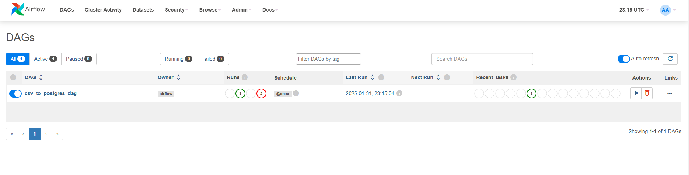

# POC Apache Airflow

This is a POC for Apache Airflow jobs.

The purpose of this project is simulate a simple ETL flow.

The job should read a **.csv** file from **data_input** folder and create and run the corresponding **INSERT** queries into postgres database.



## How to Run

1. clone this repo
2. run `docker compose up`

once docker container is up and running (both for airflow and postgres)

3. go to http://localhost:8080

(UI credentials - for demo purposes)
````
username: admin
password: admin
````

in the Airflow UI:

4. Go to Admin > Connections
5. Choose `postgres_default`
6. Edit connection:

(connection credentials - for demo purposes)
````
database: airflow
username: airflow
password: airflow
````

7. Save

You should now be able to run your DAG.
