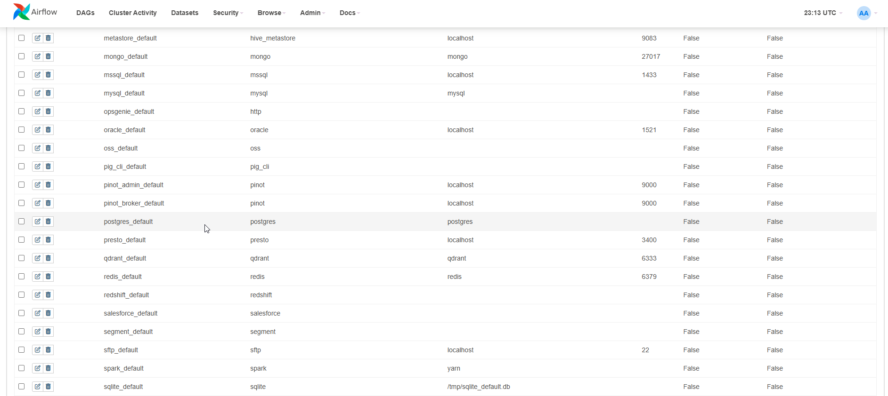
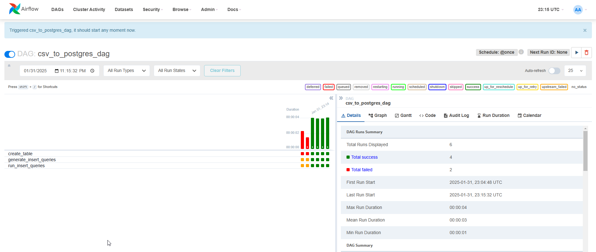
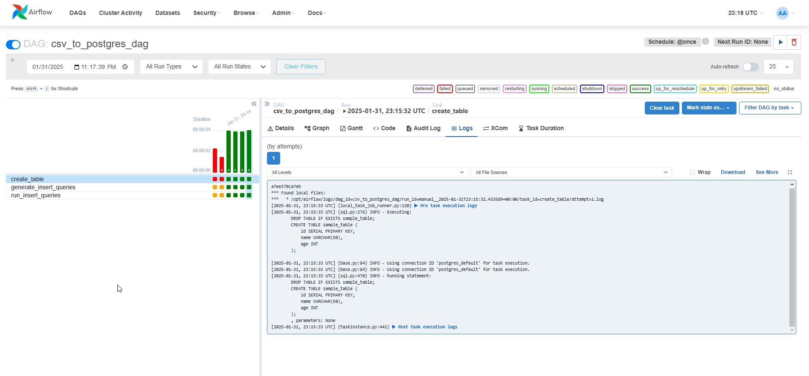

# POC Apache Airflow

### Project Overview
This project serves as a Proof of Concept (POC) for implementing an ETL (Extract, Transform, Load) workflow using Apache Airflow. The primary objective is to demonstrate the automation of data ingestion from a CSV file into a PostgreSQL database.

### Workflow Description
````
The ETL pipeline follows these key steps:

Extract:

The Airflow job reads a CSV file from the designated data_input folder.

Transform (if needed):

Any necessary data transformations or preprocessing can be applied before loading the data into the database.

Load:

The pipeline generates the appropriate INSERT SQL queries based on the extracted data.
The queries are executed to populate the PostgreSQL database.
````

## Technology Stack

- Apache Airflow: Orchestrates the ETL workflow.
- PostgreSQL: Acts as the target database for data storage.
- Python: Handles data extraction, transformation, and SQL query generation.
- This POC provides a foundational setup for an automated data pipeline, which can be extended to handle more complex ETL processes.

## Screenshots


## How to Run

1. clone this repo
2. run `docker compose up`

once docker container is up and running (both for airflow and postgres)

3. go to http://localhost:8080

(UI credentials - for demo purposes)
````
username: admin
password: admin
````

in the Airflow UI:



4. Go to Admin > Connections
5. Choose `postgres_default`
6. Edit connection:

(connection credentials - for demo purposes)
````
database: airflow
username: airflow
password: airflow
````

7. Save

You should now be able to run your DAG.




